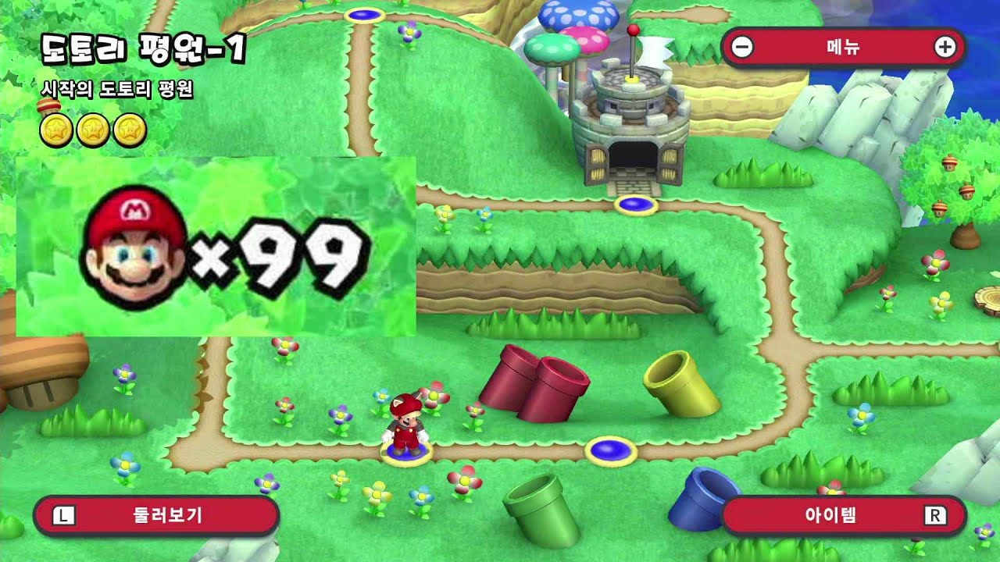

## Name
안녕하세요 저의 이름은 **진호영**입니다. 교육학과 21학번 3학년이죠. 나이는 24살입니다.

### 갑자기 노래추천
`가장 기초적인 임플란트다`라는 밈을 아시나요? 제가 최근에 많이 들었었던 노래를 공유해드립니다.
[싼데비슷한 OST](https://www.youtube.com/watch?v=eg_yMhrRD0A)
바로 '사이버펑크 엣지러너'라는 애니메이션의 노래인데요, 이 애니메이션의 장대한 서사를 알고 이 노래를 들으면 나도 모르게 눈망울이 축축해져 눈물이 주룩주룩 흘러나올 수 밖에 없을 겁니다. 가히 불가항력이라 할 수 있죠.

## History in CAU
한국 교육을 바꾸고자 하는 일념으로 무장했던 저는 무지하게도 `교육학과`에 와버리고 맙니다. 그리고 교육은 교육을 관장하는 사람보다는 정치 당론의 의중이 훨씬 더 많은 것을 결정한다는 사실을 깨닫게 됩니다. 1학년부터 방황을 시작하게 되고 마침 코로나 시기였어서 집에 혼자 침체되어 공부를 손에서 놓게 됩니다. 오히려 열심히 공부해서 탈출을 했어야됐는데 참 무지하고 무기력 했었습니다. 그렇다고 5급 교육계 공무원을 준비할 깡은 없습니다. 만약 제가 어렸을때부터 언어영역에 재능이 있었다면 도전했겠지만, 저는 수능 국어도 너무너무 어려웠던지라 다시 한번 그런 국가시험을 준비할 자신이 없습니다ㅠ 참 안타깝죠 뭐. 근데 뭐 대한민국에 이런 인생 하나쯤 있을수도 있는거 아니겠습니까. `그냥 뭐, 많이 아쉽네! ㄲㅂ!`

## Dream
저는 꿈이 여러개 입니다. 저의 꿈은 경제적인 면, 가정적인 면, 그리고 사회적인 면으로 나뉩니다.

### 경제
저는 경제적 자유를 얻는 것이 목표입니다. 자본주의 시스템에 예속되지 않고 돈의 속박으로부터 자유로워지고자 합니다. 저에게 돈이란 무엇인가를 누군가 묻는다면 저는 `가능성`이라 답하겠습니다. 돈이 인생의 모든 것은 아니지만, 돈이 모든것의 시작은 될 수 있습니다. 누군가에게는 돈이 소중한 학비일 수 있고, 다른 누군가에게는 창업 비용일 수 있고, 또 다른 누군가에게는 한 가정을 뒷받침하는 책임감일 수 있습니다. 적어도 저는 미래에 돈 때문에 무언가 새로운 시도를 하는데 있어서 좌절하거나, 돈 때문에 발목잡힐 일은 없었으면 합니다. 그래서 20살때부터 경제와 주식에 대해 공부하고, 열심히 알바비 벌고 돈을 아껴가면서 쌈짓돈이라도 주섬주섬 주식계좌에 넣고 있습니다. 지금은 얼마 안되는 푼돈이지만 언제가는 `화성 갈끄니까~~`

### 가정
좋은 아빠가 되는 것이 저의 또 다른 꿈입니다. 호모 사피엔스 포유류로서 아들 하나 딸 하나 낳아 잘 길러보고 싶습니다. 행복이 어디 다른데 있겠습니까, 그냥 일 끝나고 집 오면 와이프가 반겨주고 아이들이 반겨주면 그게 행복이고 호모 사피엔스가 누릴 수 있는 가장 이상적인 형태의 기쁨이 아닐까 싶습니다. 결혼은 꼭 하고싶네요.

### 사회
저는 솔직히 명예욕이란게 좀 있습니다. 저는 정치권력과 괴리가 있는 명예야말로 인간 사회에서 얻을 수 있는 최고의 존경과 존엄을 누릴 수 있다고 생각합니다. 바로 기업가들이 이에 해당하죠. 그래서 소프트웨어벤처 융합전공을 선택했습니다. 성공하면 대박아니겠습니까? 소프트웨어는 실패해도 빚더미에 앉을 염려는 없다는 것이 참 매력적입니다. 99번 실패해도 딱 한번만 성공하면 되는 것 아니겠습니까? 기회가 100번이나 있다니 완전 대박이네요. 소프트웨어 최고!

